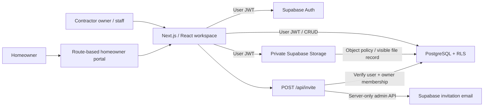

# Updated ownership model

Omnibuild is the platform operator, and organizations are its contractor clients. The main `/` route is the platform hub. Contractor workspaces live at `/workspace/[slug]`; homeowner portals remain at `/portal/[slug]`. See [Platform and WhatsApp](PLATFORM_AND_WHATSAPP.md) for the updated role hierarchy, website demonstration, and communications architecture.

# Architecture

One Next.js deployment serves many companies. A company's portal URL is `/portal/[organizationSlug]`; a slug selects presentation context and never grants authorization.

## Application boundaries

- `app/`: routes, authentication callbacks, password setup, and the invitation API.
- `proxy.ts`: server-side session refresh using the current Next.js proxy convention.
- `components/workspace.tsx`: interactive dashboard, contractor CRUD, and homeowner screens. Roles affect available controls; database policies remain authoritative.
- `lib/data.ts`: shared row/dataset shape and explicitly fictional sample data.
- `lib/supabase.ts`, `lib/server.ts`: browser and cookie-aware server clients.
- `lib/validation.ts`: strict invitation validation and file constraints.
- `supabase/migrations/`: reproducible schema, policy, and hardening changes.
- `supabase/tests/`: database security contract used by both pgTAP and the embedded harness.

The MVP loads the user's RLS-visible workspace on sign-in and refreshes it after mutations. Browser Supabase clients refresh active sessions; the server validates users before privileged operations. Conversations refresh on load/mutation rather than using realtime subscriptions. Pagination/realtime are future scaling work.

## Two data modes

With public Supabase configuration, the app requires authentication and uses the database exclusively. Without configuration, a visible demo badge appears and localStorage persists illustrative data. Demo data is never silently inserted into hosted environments. The demo portal is only a UI preview, not a security model.

## Deployment model

A single Vercel deployment connects to a hosted Supabase project. Staging and production should have separate Supabase projects and environment variables. Migrations are applied once per environment. Each organization is a tenant within the same PostgreSQL schema; no per-client deployments, custom domains, microservices, or self-hosted Supabase are included.
