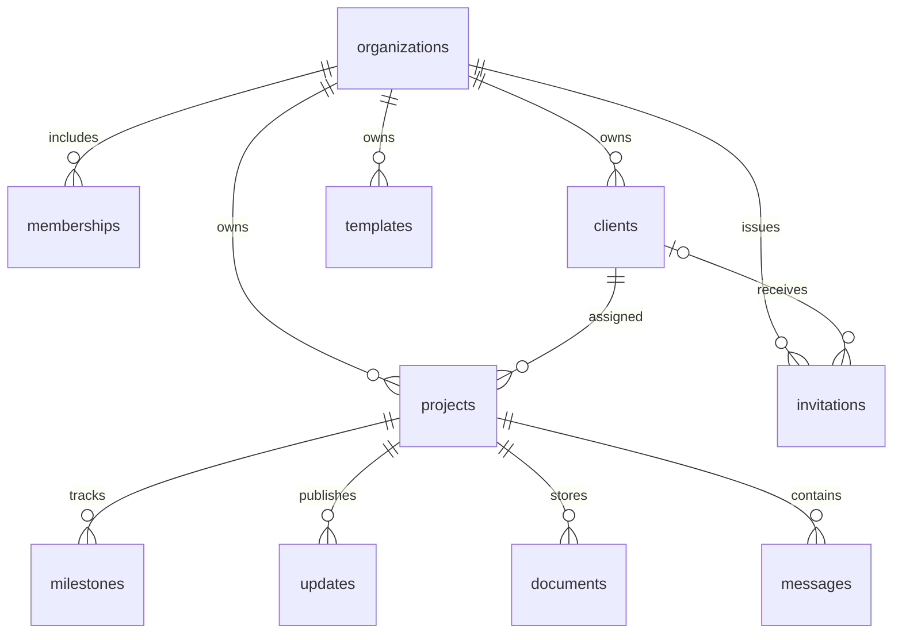

# Database

Every tenant-owned child record has an `organization_id`. Project relationships use composite foreign keys so a valid UUID from another tenant cannot be assigned through a manipulated payload.

| Table         | Purpose / important constraints                                                   |
| ------------- | --------------------------------------------------------------------------------- |
| organizations | Company name, unique validated slug, optional logo URL                            |
| memberships   | Composite organization/user key; owner or staff role                              |
| clients       | Contact details, optional auth user binding, archive flag, tenant-unique email    |
| projects      | Client assignment, status, overview, target date; composite client FK             |
| milestones    | Project step, due date, completion flag                                           |
| updates       | Project title/body with explicit `client_visible` flag                            |
| documents     | File metadata for documents and photos; unique tenant/project-scoped object path  |
| messages      | Project conversation; authenticated sender, body, optional JSON suggested replies |
| templates     | Tenant staff-only editable message and suggested replies                          |
| invitations   | Owner-issued email grant for a staff member or client; accepted timestamp         |

Milestones, updates, documents, and messages reference `(organization_id, project_id)`. File paths are exactly `organization UUID/project UUID/random UUID-sanitized filename`. Files reside in the private `project-files` bucket. Metadata is created after upload; a failed metadata insert triggers best-effort object cleanup.

Indexes cover organization lookups, client auth identity, project assignment, and message ordering. Immutable-identity triggers prevent changing a child record's ID or tenant. Client auth bindings can only be assigned by trusted invitation acceptance, not direct authenticated table writes.

`create_organization` atomically creates the organization, initial owner membership, and starter template. `accept_invitations` locks matching unexpired invitations, adds staff memberships or associates a client, and marks the invitation accepted. These security-definer functions have a fixed empty search path and explicit authenticated-only execution grants.

Apply migrations in filename order. `supabase db reset` rebuilds a local environment. `supabase db push` applies unapplied migrations to the linked hosted environment. Never edit an applied migration on a deployed project; introduce a new migration instead.
