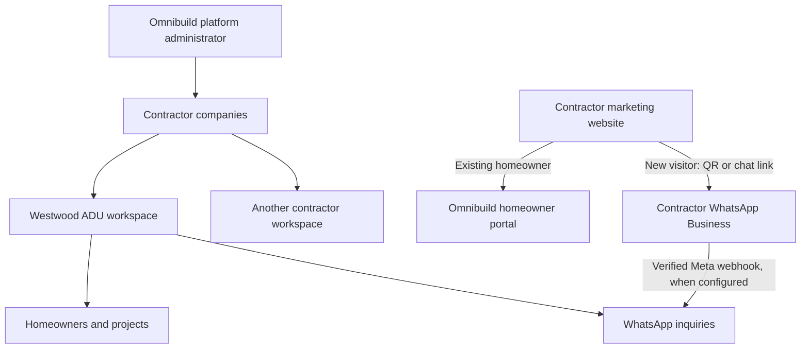

# Omnibuild platform and contractor website demonstration

## Ownership model

Omnibuild is the SaaS operator. Its customers are contractor companies such as Westwood ADU. Homeowners are the contractor's customers, not Omnibuild's contractor accounts.



| URL                       | Audience                                                                                        |
| ------------------------- | ----------------------------------------------------------------------------------------------- |
| `/`                       | Omnibuild platform hub; authenticated contractors/homeowners are redirected to their own area   |
| `/login`                  | Sign-in/account creation; creating an auth account does not grant platform or contractor access |
| `/workspace/[slug]`       | Contractor staff/owner workspace, also accessible to Omnibuild administrators                   |
| `/portal/[slug]`          | Homeowner project experience                                                                    |
| `/demo/contractor/[slug]` | Fictional public marketing website, with portal link and WhatsApp QR                            |
| `/demo/chat/[slug]`       | Clearly labeled, browser-local WhatsApp simulation (disabled in connected mode)                 |

The website uses original Westwood copy and the repository's ADU illustration. The services, consultation path, and marketing sections are inspired by [9ADU](https://9adu.com/); it is not affiliated with that company and does not reuse its logo, customer quotes, or project photography.

## Configure the first Omnibuild administrator

Apply all migrations, including `202609110001_platform.sql`. Sign up at `/login` and confirm email. In the Supabase SQL editor, an authorized database operator grants the intended Omnibuild account:

```sql
insert into public.platform_admins(user_id)
select id from auth.users where email = 'YOUR_OMNIBUILD_ADMIN_EMAIL';
```

This grant is never available through browser signup, editable user metadata, or a contractor API. Existing contractor memberships remain intact. The earlier self-service organization-creation function is no longer executable by authenticated users. New contractor companies are created through the platform-only `create_contractor` function.

Omnibuild administrators intentionally have management access across contractor accounts. Contractor owners/staff remain isolated to their own companies; homeowners remain restricted to their assigned projects. Only platform administrators can issue contractor-owner invitations or configure the Meta phone-ID routing table. Staff/owner invitations preserve an existing owner's role when a staff invitation is accepted.

In the hub, add a contractor name, unique slug, owner email, optional website, and optional WhatsApp number. Save, reopen Manage account, and invite the owner. Account creation and email sending are separate actions; creating a contractor never silently sends an email.

## QR codes versus inbox synchronization

A number in international format generates a `https://wa.me/<digits>?text=...` link and downloadable PNG QR code locally; no third-party QR service receives the number. The QR opens the contractor's WhatsApp conversation. It does **not** grant Omnibuild access to chats.

The WhatsApp Business App alone is not wired into this integration. Real inbound synchronization requires the WhatsApp Business Platform/Cloud API and a Meta app configured for webhooks. Existing app numbers may require a supported onboarding/coexistence arrangement; that onboarding is not implemented here. Verify eligibility with Meta before choosing the live account flow.

Without a number, the QR and chat button explicitly open a **simulation**. A visitor submits a fictional name, phone, and message; it appears under the selected contractor in the same browser's Omnibuild Communications tab and contractor Messages → WhatsApp inquiries. Stage changes and simulated replies persist locally. Different devices/browsers do not share this demo data. No outbound WhatsApp calls or emails occur in this demo.

## Live inbound webhook setup

1. Configure `NEXT_PUBLIC_SUPABASE_URL`, `NEXT_PUBLIC_SUPABASE_ANON_KEY`, and the server-only `SUPABASE_SERVICE_ROLE_KEY`.
2. Set server-only `WHATSAPP_APP_SECRET` and a strong `WHATSAPP_VERIFY_TOKEN` in the hosting environment.
3. In Meta, configure the callback URL `https://YOUR_OMNIBUILD_DOMAIN/api/whatsapp/webhook`, use that verify token, and subscribe to message events for the relevant business account.
4. As the database operator or platform administrator, map the **receiving Meta phone number ID** to the correct contractor. This is not the same value as the displayed phone number:

```sql
insert into public.whatsapp_accounts(organization_id, phone_number_id)
values ('CONTRACTOR_ORGANIZATION_UUID', 'META_PHONE_NUMBER_ID');
```

5. Set the contractor's public WhatsApp number in Manage account. Confirm that its QR points to the same business number represented by the configured Meta ID.
6. Send a real test message from a separate WhatsApp account and check the contractor's inbox. This hosted test requires credentials and has not been performed in this workspace.

The webhook verifies Meta's HMAC SHA-256 signature over the exact request body, rejects oversized/malformed requests, resolves the contractor from a server-managed receiving phone ID, and calls a service-role-only transactional ingestion function. Repeated provider message IDs do not duplicate messages. A phone contacting two contractors creates separate tenant-owned inquiries. Unknown receiving IDs are acknowledged without inserting records. Storage errors return 500 so the sender can retry.

This version supports inbound text and descriptive placeholders for other message types. It does not download WhatsApp media, import historical chats, synchronize sent messages/delivery receipts, or send live replies from Omnibuild. Connected inboxes provide an Open WhatsApp action; demo inboxes allow explicitly simulated replies. Automatic refresh is limited to reload/manual Refresh and local demo events.

If adding outbound API messaging later, distinguish Omnibuild's internal message templates from Meta-approved templates. WhatsApp imposes a 24-hour service window for free-form replies and approved-template rules outside that window. See [WhatsApp Business Messaging Policy](https://whatsappbusiness.com/policy/) and [Meta developer documentation](https://developers.facebook.com/docs/whatsapp/cloud-api/).

## Vercel demonstration

The repository is a standard Next.js Vercel deployment. The same deployment can show the full journey at `/` and `/demo/contractor/westwood-adu`, avoiding cross-origin localStorage differences during a sales demo. Keep Supabase variables unset for a fictional browser-local presentation. Do not mix production records into a public demo deployment.

To publish the latest local source after signing into the intended Vercel account:

```sh
npx vercel
```

Choose a new project for the presentation, use the repository root, and accept the detected Next.js defaults. Deploy with the exact verified source. No `.vercel` account settings or secrets should be committed. If making a separate contractor-site deployment, `NEXT_PUBLIC_OMNIBUILD_URL` can point its portal links to the actual Omnibuild origin; the browser-local simulation does not sync across different origins.

Deployment has not been completed: Vercel requires sign-in. Automatic approval review blocked initiating GitHub sign-in without explicit account authorization. No Vercel project, public URL, or live Meta account was created by this change.
